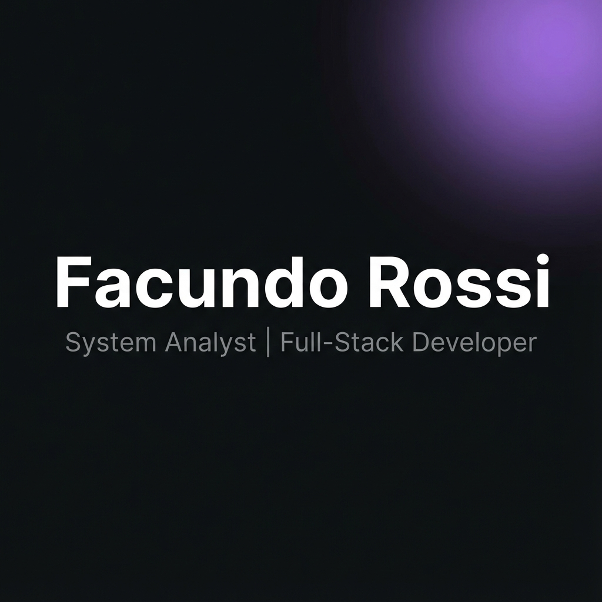

# My Personal Portfolio   

> Click the image above to visit the live website.

---

### Features

- **Responsive Design**: Fully optimized for desktops, tablets, and smartphones.
- **Dark/Light Theme Toggle**: Easily switch themes based on preference.
- **Project Showcase**: Filterable portfolio to highlight various projects.
- **Interactive Contact Form**: Users can send messages directly from the site.
- **Smooth Animations**: Provides a seamless user experience.

## 🛠 Technologies Used

- **Framework:** [Astro](https://astro.build)
- **Styling:** [Tailwind CSS](https://tailwindcss.com)
- **Icons:** [Heroicons](https://heroicons.com)
- **Deployment:** [Vercel](https://vercel.com)

## 🤝 Contributing

Contributions, issues, and feature requests are welcome!  
Feel free to check the [issues page](https://github.com/facur3/my-portfolio/issues).
